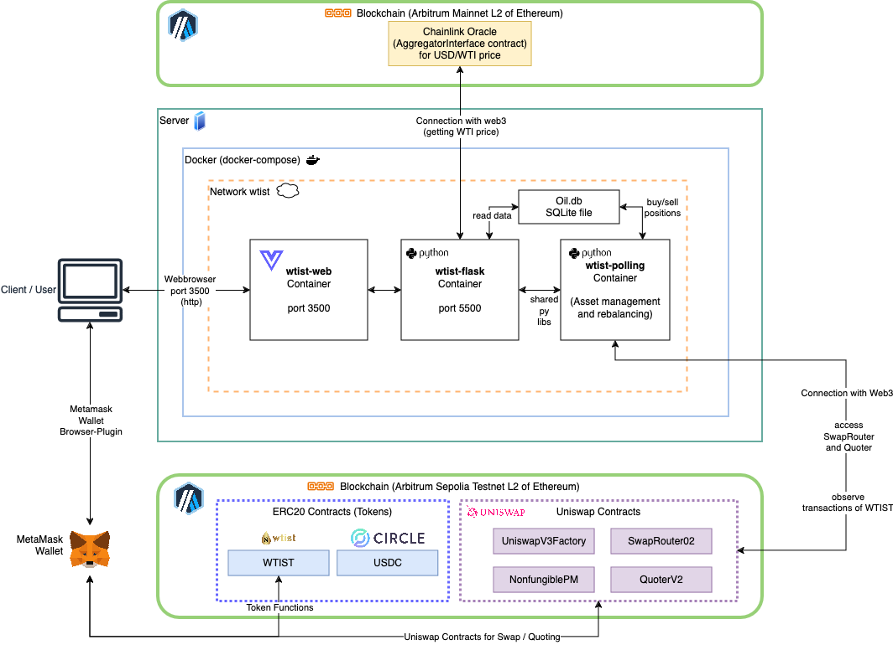

# Western Texas Intermediate Stablecoin
Symbol: _WTIST_
Chain: [Arbitrum Sepolia (Testnet)](https://sepolia.arbiscan.io/)

This monorepo consists of the ERC20 solidity contracts for the stablecoin and a simple backend to enable the rebalancing on the stablecoin.
Read the topics below, to learn more about this project.

This project is a part of the challenge task for the Blockchain module ([BlCh HS-2024](https://dsl.i.ost.ch/lect/hs24/)) at the Eastern Switzerland University of Applied Sciences.
The challenge tasks was to create a stablecoin that can be traded on a DEX (Decentralized Exchange) and has a rebalancing mechanism.

## Project Requirements Compliance

_As required by the task this project contains:_

✅ Working Prototype
- A simple frontend (with Vue.js and Primevue)
  - It is able to swap stablecoin
  - Status and process are shown in the frontend
- Stablecoin representing WTI crude oil price
- Deployed on Arbitrum Sepolia

✅ Latest Library Versions
- Vue.js
- Primevue
- ethers.js (v6)
- Hardhat
- Web3.py

✅ Public Blockchain Interaction
- Deployed on Arbitrum Sepolia (L2 Ethereum)
  - Trading/Swapping with Uniswap (and Pancakeswap)

✅ DEX Tradability
- Uniswap pool created with WTIST/USDC pair
- Swap functionality implemented

✅ Automatic Rebalancing of the Stablecoin (described below)
- Backend mechanism to maintain price stability
- Scenarios for price fluctuations defined

✅ Frontend Status Tracking
- Vue.js frontend with process and status display


## Concept
This project is a concept for a stablecoin representing the price of Western Texas Intermediate (WTI) crude oil.
Western Texas Intermediate is a grade crude oil from the United States.

### Stability Mechanism

Our stablecoin maintains its value through a sophisticated rebalancing algorithm that:
- Monitors the WTI crude oil price using Chainlink's price feed
- Checks the liquidity pool ratio every 5 minutes
- Automatically adjusts token quantities to maintain a +/- 1% price stability

Key Rebalancing Components:
- Real-time WTI price tracking
- Liquidity pool ratio analysis
- Automated swap mechanisms to stabilize pricing

### Scenarios
We make sure to cover two different scenarios with our stablecoin, where we must counteract automatically with a rebalancing method to keep the price of the targeted asset stable.

#### Price of the WTI asset goes up in the real world
1. The balance of WTIST of the pool contract gets checked
2. If the balance is below 10 WTIST, we add liquidity for another 100 WTIST.
3. Rebalancing: We swap the USDC for WTIST until the price target is met.
4. We get WTIST
5. Price for WTIST goes up as we remove WTIST and add USDC by swapping.

#### Price of the WTI asset goes down in the real world
1. The balance of USDC of the pool contract gets checked
2. If the balance is below 100 USDC, we add liquidity for another 1000 USDC.
3. Rebalancing: We swap the WTIST for USDC until the price target is met.
4. We get USDC
5. Price for WTIST goes down as we remove USDC and add WTIST by swapping.

We also need to make sure to maintain the amount of WTIST that we can provide.
To do so we do the following checks regularly with our backend application:

1. The balance of WTIST of the backend address gets checked
2. If the balance of WTIST is below 1'000 WTIST, we mint another 500'000 WTIST.

### Future Opportunities
In the future the stablecoin tokenomics can be enhanced by incentivising users to stake their tokens in a liquidity pool with a Uniswap staker.
Another idea is to offer users of our App the possibility to buy and sell stablecoins directly on the App. 
This ensures that the users are getting an opportunity to get the stablecoin at the best price possible, even when there are fluctuations on the DEX.

#### Risk Management
- Over collateralization 10%

## Infrastructure
The diagram below explains the infrastructure overview of the dockerized application. 
Details can be found in the sections below and in the respective folders of the repository for each component.



### Contracts
The contracts are deployed on the Arbitrum Sepolia chain. 
This is only a Testnet chain and runs on L2 of Ethereum. 
There are some advantages of using a layer 2 chain over the Ethereum Blockchain as described in the following [blog](https://medium.com/@floating_monkey/possibilities-and-advantages-of-using-arbitrum-compared-to-ethereum-78a4cafc44d5).

1. Low Fees and Efficient Scalability
2. Ethereum / EVM compatibility (We could also deploy our contracts on different L2 or on the main chain).
3. High security level 

More information:
- [Arbitrum Foundation](https://arbitrum.foundation/)
- [Arbitrum Website](https://arbitrum.io/)

#### Uniswap contracts
The uniswap contracts which are deployed on Arbitrum Sepolia are from the official documentation: [Uniswap Contract Deployments](https://docs.uniswap.org/contracts/v3/reference/deployments/arbitrum-deployments).

Below are the contracts we used to create the pool and to use the SwapRouter from Uniswap.
| **Contract**               | **Arbitrum Sepolia Addresses**               | **Description**                                       |
|----------------------------|----------------------------------------------|-------------------------------------------------------|
| UniswapV3Factory           | `0x248AB79Bbb9bC29bB72f7Cd42F17e054Fc40188e` | This contract is used to create token pairs for pools |
| NonfungiblePositionManager | `0x6b2937Bde17889EDCf8fbD8dE31C3C2a70Bc4d65` | Used to interact with the Uniswap Liquidity Position  |
| QuoterV2                   | `0x2779a0CC1c3e0E44D2542EC3e79e3864Ae93Ef0B` | Can be used to get the current price for a token pair |
| SwapRouter02               | `0x101F443B4d1b059569D643917553c771E1b9663E` | Used to swap between the tokens USDC and WTIST        |

Below are the technical details of our pool to swap between WTIST ↔️ USDC on the frontend.
| Setting                        | Value                                                                   |
|--------------------------------|-------------------------------------------------------------------------|
| Fee                            | `10000`                                                                 |
| PoolToken (TokenId)            | `1075`                                                                  |
| Pool (Contract for Token Pair) | `0x2F08A874270c0A07F10af8F6FD71044218c0b2A9` (USDC - WTIST - Fee 10000) |
| Initial sqrtPriceX96           | `658118545356139461083136`                                              |
| Initial tick                   | `-233981`                                                               |
| Tick spacing                   | `200`                                                                   |

Tick spacing:
https://docs.uniswap.org/concepts/protocol/concentrated-liquidity
=> Lower ticks better for stablecoin

### Backend
**Technologies used:** Solidity, Hardhat, [multisol](https://github.com/PaulRBerg/multisol) (for contract verification on Arbiscan).

#### REST API

### Frontend
**Technologies used:** Node, Vue.js, Vite, Typescript, [ethers.js (v6)](https://docs.ethers.org/v6/), [PrimeVue](https://primevue.org/)

To test the ethers.js package open the following website:
[Ethers Playground](https://playground.ethers.org/)


## Getting Started

### Prerequisites
- Docker
- Node.js (v18+ recommended)
- Metamask or equivalent Web3 wallet

### Installation Steps
1. Clone the repository
   ```shell
   git clone https://github.com/Norukh/wti-stablecoin.git
   cd wtist-stablecoin
      ```
   
2. Set up environment variables - Create a .env file with:
   ```shell
   PROVIDER_URL="provider_url" # Replace with your Arbitrum Sepolia RPC provider URL
   PRIVATE_KEY="your_private_key" # Address of the wallet that will deploy the smart contracts
   ```
    > **Make sure that your wallet has enough WTIST and USDCs to perform the Swaps**

3. DOCKER COMPOSE #TODO NICO

## Usage for development

```shell
# compile the solidity code
yarn hardhat compile

# run a single local node
yarn hardhat node

# deploy to localhost
yarn hardhat run scripts/deploy.ts --network localhost 

# set variables
yarn hardhat vars set ARBITRUM_PRIVATE_KEY <your-private-key>
yarn hardhat vars set ARBITRUM_SEPOLIA_API_KEY <your-api-key>

# set variables for testing
yarn hardhat vars set ARBITRUM_PRIVATE_KEY 0x0000000000000000000000000000000000000000000000000000000000000000
yarn hardhat vars set ARBITRUM_SEPOLIA_API_KEY 0x0000000000000000000000000000000000000000
```

This project demonstrates a basic Hardhat use case. It comes with a sample contract, a test for that contract, and a Hardhat Ignition module that deploys that contract.

Try running some of the following tasks:

```shell
npx hardhat help
npx hardhat test
REPORT_GAS=true npx hardhat test
npx hardhat node
npx hardhat ignition deploy ./ignition/modules/Lock.ts
```

## Authors
- [Nico Fehr](mailto:nico.fehr@ost.ch?subject=WTIST%20Feedback)
- [Micha Harzbecker](mailto:micha.harzbecker@ost.ch?subject=WTIST%20Feedback)
- [Tom Stromer](mailto:tom.stromer@ost.ch?subject=WTIST%20Feedback)